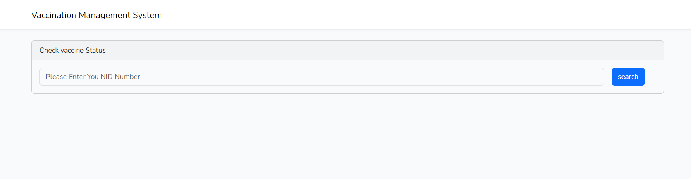
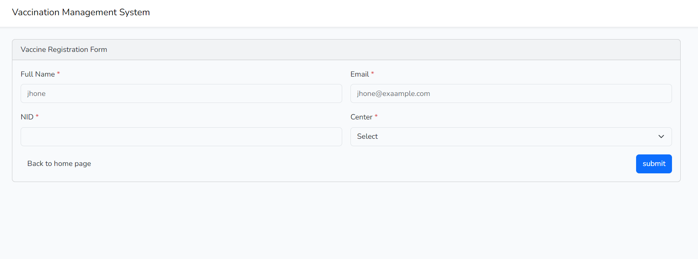

## About this project

This application is built using :

<ul>
    <li><a href="https://laravel.com/" target="_blank">Laravel 11</a> (featuring <a href="https://vitejs.dev/" target="_blank">Vite</a>) and minimum php version 8.2</li>
    <li>MySQL latest version I`m using .But You can use any those are supported by laravel ORM</li>
    <li><a href="https://getbootstrap.com/" target="_blank">Bootstrap 5.3</a></li>
    <li><a href="https://icons.getbootstrap.com/" target="_blank">Bootstrap Icons 1.11.3</a></li>
    <li>Any latest stable NodeJs for npm support </li>
    <li>In client site laravel blade has been used . </li>
</ul>

## Installations
<ul>
<li> Clone repository into your server work DIR :

```
git clone git@github.com:wubrafiq807/kaf-vaccine.git  kaf-vaccine
```
</li>
<li>
Backend setup: I`m using <a href="https://laravel.com/docs/11.x/homestead" target="_blank"> laravel homestead </a>; you can use php artisan server or docker 
</li>
<li>
 No go to your application root :
  Copy .env.example file to .env 

Update Database connection ENV values with yours: 

```
DB_CONNECTION=mysql
DB_HOST=127.0.0.1
DB_PORT=3306
DB_DATABASE=your db name
DB_USERNAME=your user db name
DB_PASSWORD=********

```
Update Email sending ENV with yours 

```
MAIL_DRIVER=smtp
MAIL_HOST=smtp.gmail.com
MAIL_PORT=587
MAIL_USERNAME=hello@example.com
MAIL_PASSWORD=***********
MAIL_ENCRYPTION=tls
MAIL_FROM_ADDRESS="hello@example.com"
```

Run list of command bellow
```
composer i

php artisan migrate

php artisan db:seed

php artisan key:generate

php artisan o:c

npm install

npm run dev
```
## Important note:

1. Without npm install and  npm run dev server , Bootstrap will not work 

2. Need to run Scheduler Cron Jobs for updating  vaccination schedule date and email notification functions

## Running the Scheduler Locally

Typically, you would not add a scheduler cron entry to your local development machine. Instead, you may use the schedule:work Artisan command. This command will run in the foreground and invoke the scheduler every minute until you terminate the command:

```php artisan schedule:work```

To terminate run the command: 

```php artisan schedule:interrupt```

Click <a href="https://laravel.com/docs/11.x/scheduling#running-the-scheduler-locally">here<a/> to see more details about laravel scheduler 
</li>

</ul>

## TODO

Unit Test is crucial to make sure code coverage and quality and ignore legacy .Need to Repository , Providers, Controllers 

## Note
No User authentication , and authorization has been implemented 

## Search Page



## Registration Page


